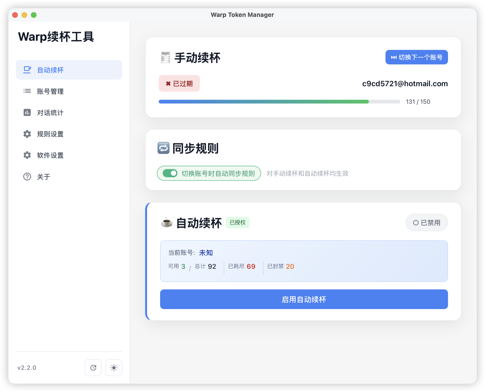
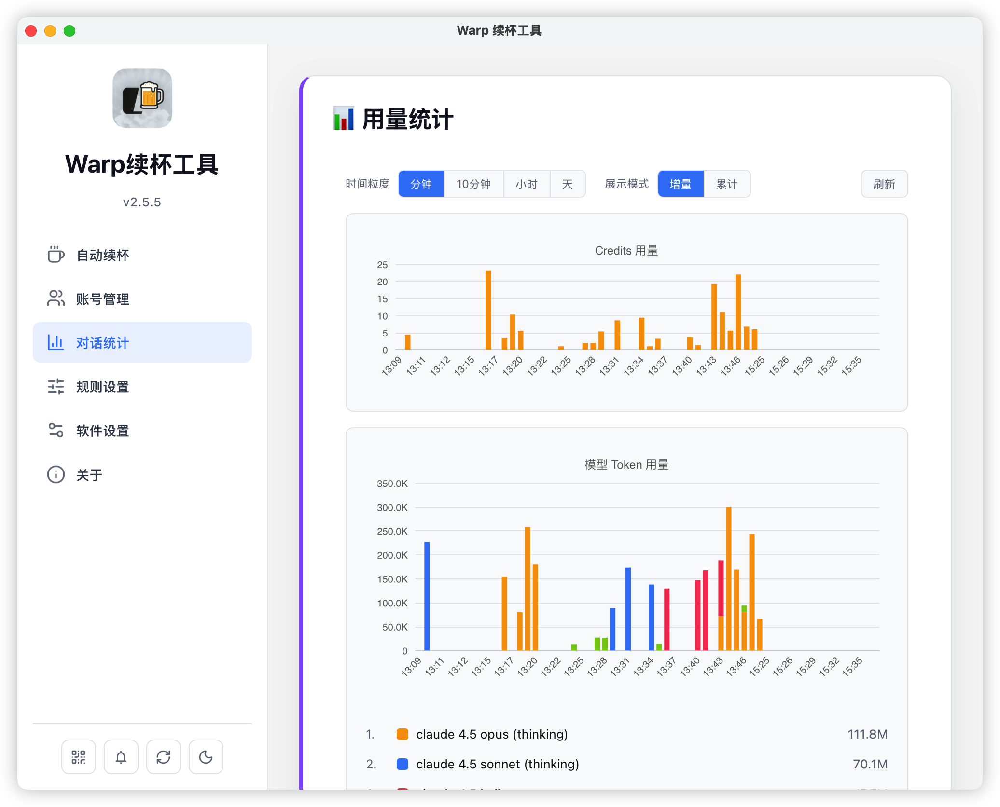
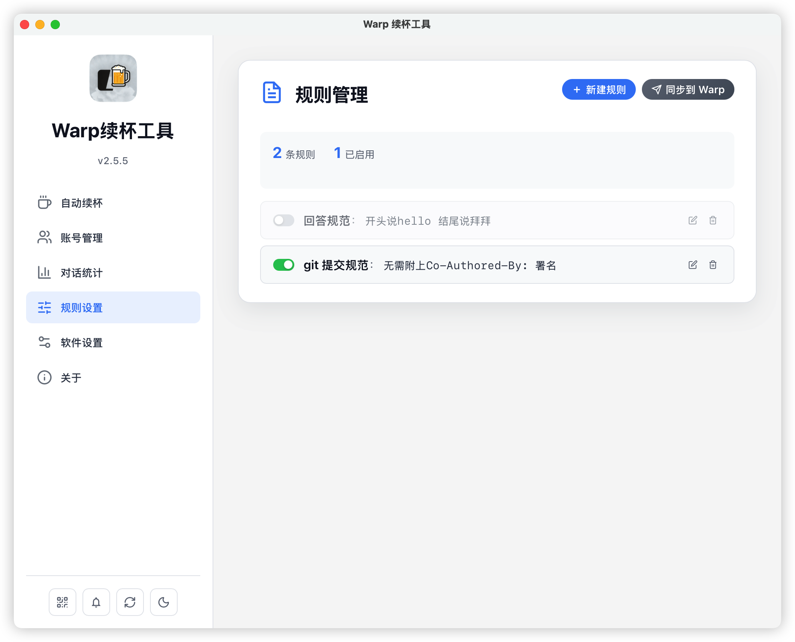

# Warp Token Manager

一款用于管理 Warp AI 终端 Token 的桌面应用，帮助你高效管理多个账号并自动续杯。

## 功能特性

### 🔄 自动续杯
- 自动轮换 Token，用完自动切换下一个
- 支持手动切换账号
- 同步规则设置，切换账号时自动同步

### 📋 账号管理
- 批量导入和管理多个账号
- 实时显示每个账号的用量状态（可用/满额/封禁）
- 一键刷新账号状态
- 支持分页浏览，轻松管理大量账号

### 📊 对话统计
- 统计账号数、对话数、积分消耗、Token 用量
- 模型使用分布可视化（Claude、GPT 等）
- 追踪每个模型的 Token 消耗

### ⚙️ 规则管理
- 本地管理 Warp Agent 规则
- 一键同步规则到 Warp
- 启用/禁用规则

### 🖥️ 系统托盘
- macOS 状态栏实时显示剩余用量

## 软件截图

### 自动续杯

### 账号管理

### 对话统计

### 规则管理

## 下载安装

前往 [Releases](https://github.com/whatbugsyou/token-manager-releases/releases) 下载最新版本。

## 系统要求

- macOS 10.15+ / Windows 10+
- 需要已安装 [Warp](https://www.warp.dev/) 终端

## 注意事项

- 首次运行可能需要授权访问 Keychain
